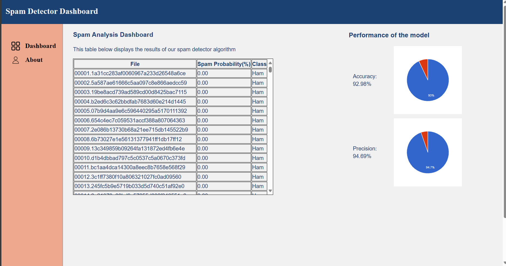
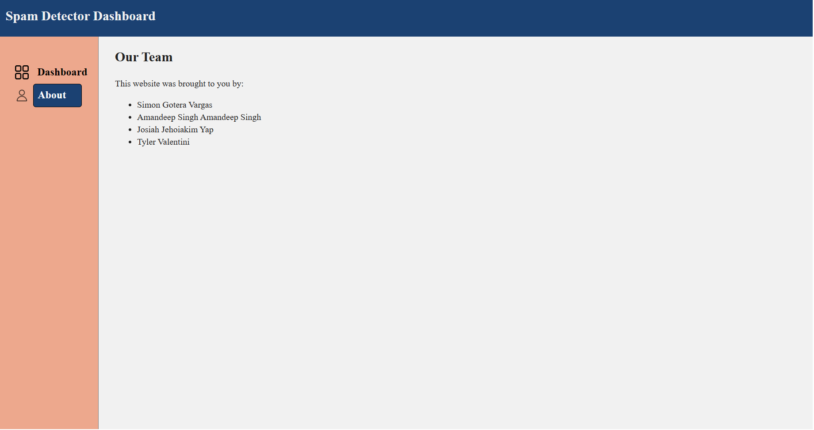

# Spam Detector

## Project Information
- **Course**: CSCI 2020U: Software Systems Development and Integration
- **Components**:
    - SpamDetectorClient: HTML, CSS, and JavaScript
    - SpamDetectorServer: Java and JAX-RS

- ### Client Side
  This project leverages JavaScript to fetch data from a server-side APIs, subsequently displaying the retrieved data in both tabular and chart formats on the client side.
The data is dynamically loaded into an HTML table for easy visualization and the accuracy and precision are displayed graphically using charts, facilitating better comprehension of the dataset's trends and insights.

- ### Server Side
    The whole process of server side can be explained as following:
  - ### Training Phase

    - #### Data Collection
      - We Read all files in the training/ham and training/spam folders, each containing ham and spam files.

    - #### Word Frequency Calculation
      - We Counted how many files contain each word which appear in either spam or ham.
      - We Created two frequency Tree maps:
          - `HamOccurances`: Map of words to the number of files containing each word in the ham folder.
          - `spamOccurances`: Map of words to the number of files containing each word in the spam folder.

    - #### Calculate Probabilities
      - We Calculated probabilities:
          - `Pr(S|Wi)`: Probability that a file is spam given that it contains word Wi.
          - `Pr(Wi|S)`: Probability that word Wi appears in a spam file.
          - `Pr(Wi|H)`: Probability that word Wi appears in a ham file.
      - We Stored these probabilities in a Treemap `probOfAllWords` indexed by the word Wi.

  - ### Testing Phase

    - ### Data Examination
      - We read each file in the test/ham and test/spam folders.

    - ### Word Probability Calculation
      - For each word in the file, We used the probabilities from the training phase to calculate:
          - Ham and spam probabilities for each word.
          - Probability that the file is spam based on the words it contains.

### Evaluation
- We compared the calculated probability of the file being spam to a threshold.
- Classified the file as spam or ham based on whether the probability exceeds the threshold.
- As we already knew the spam/ham class of emails being tested, we measured the `accuracy` and `precision` which are and respectively.

### Endpoints
- `http://localhost:8080/spamDetector-1.0/api/spam`
- `http://localhost:8080/spamDetector-1.0/api/spam/accuracy`
- `http://localhost:8080/spamDetector-1.0/api/spam/precision`
## Group Members
- Amandeep Singh
- Simon Gotera Vargas
- Josiah Jehoiakim Yap
- Tyler Valentini

## Improvements

- ### Model Improvements
  In our pursuit of refining the model's spam detection capabilities, 
 we implemented several strategic enhancements. Foremost among these was a shift in our approach to processing email content.
 Instead of treating emails as mere bag of words, we began prioritizing the extraction of information from subject lines. Recognizing subject lines as pivotal components containing 
 summaries of email content, we leveraged this insight to capture crucial data from the outset, potentially enhancing our model's 
 ability to discern spam from legitimate messages. Furthermore, we embarked on a meticulous curation process to optimize the selection of words for analysis. This involved the deliberate 
 exclusion of commonplace linguistic elements, such as pronouns and articles, which typically contribute little semantic value.
 By eliminating these words from consideration, we aimed to refine the model's feature set, 
 enabling it to focus more effectively on identifying words
 patterns indicative of spam content. This refinement not only served to mitigate noise within the dataset but also improved the precision and reliability of our probability estimates, thereby enriching the model's ability to accurately classify emails.

- ### User Interface Improvements
  To enhance accessibility and interactivity, the project applies the :focus pseudo-class to links altering the body's content. 
This emphasizes the current page by setting a background color, adding a border, and adjusting the font color for improved visual clarity. 
Additionally, the :hover pseudo-class introduces animations for links affecting the body content, mirroring the properties of :focus but with a wider border for distinction.
A transition property ensures smooth transitions, with changes occurring over 0.2 seconds. Leveraging the Google Chart library and JavaScript, the project creates two pie charts to visualize the precision and accuracy of the model,
enhancing data representation and user engagement. To clarify, the table data is made scrollable, ensuring that users can navigate through large datasets with ease, facilitating efficient data exploration and analysis.

- ### Data
    To enhance the accuracy of our probability estimates, we merged the contents of 'ham1' and 'ham2' directories into a single 'ham' dataset. 
This consolidation allowed us to incorporate a broader range of legitimate email vocabulary, leading to more refined probability calculations.
By combining these datasets, our model gained a deeper understanding of typical language usage, thereby improving its ability to discern between spam and non-spam content with greater precision.

## How to Run the Project Locally

- ####  Download GlassFish Server
  - Download and install GlassFish Server from the official website or a trusted source.

- #### Open Project in IntelliJ
  - Open IntelliJ IDEA and load the project containing the server-side code.

- ####  Edit configuration
  - In IntelliJ, go to file -> edit configuration and set up maven project to deploy WAR exploded locally.

- #### Deploy Locally
  - Deploy the generated WAR file to GlassFish Server by clicking on run project button on top.

- #### Access Through Client Side Files
  - Ensure that the client-side files (HTML, CSS, JavaScript) are configured to make requests to the local server.
  - Run the client-side files in a web browser to interact with the application. Make any necessary adjustments to URLs or endpoints to connect to the local server.

## Other Resources
  The project utilizes the Google Chart library for creating pie charts to visualize precision and accuracy data.

